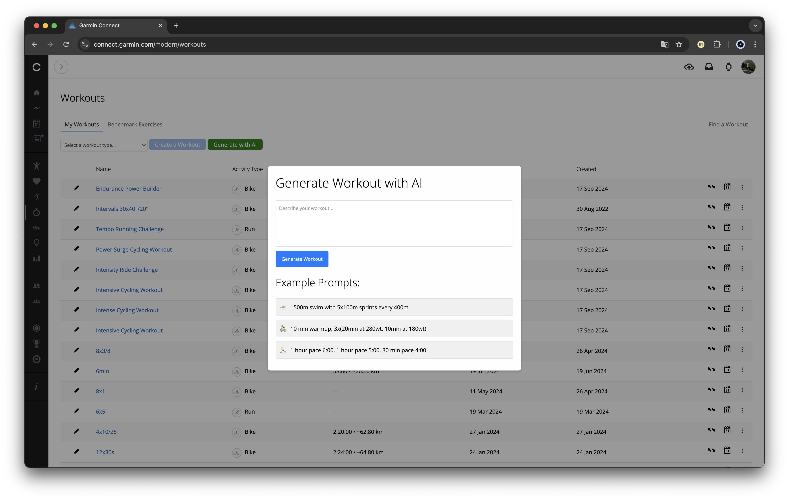

# OpenAI Garmin Workout

An chrome plugin that integrates OpenAI's GPT to generate Garmin workouts programmatically and sends them to Garmin Connect.



## Description

This project allows you to create complex Garmin workouts using natural language input processed by OpenAI's GPT.
It supports features like targets, repeats, and nested steps, transforming workout descriptions into payloads compatible with Garmin's API.

## Installing

1. Check if your `Node.js` version is >= **20**.
2. Run `npm install` to install the dependencies.

## Developing

run the command

```shell
$ cd openai-garmin-workout

$ npm run dev
```

### Chrome Extension Developer Mode

1. set your Chrome browser 'Developer mode' up
2. click 'Load unpacked', and select `gpt-garmin-workout/build` folder

### Nomal FrontEnd Developer Mode

1. access `http://0.0.0.0:3000/`
2. when debugging popup page, open `http://0.0.0.0:3000//popup.html`
3. when debugging options page, open `http://0.0.0.0:3000//options.html`

## Packing

After the development of your extension run the command

```shell
$ npm run build
```

Now, the content of `build` folder will be the extension ready to be submitted to the Chrome Web Store. Just take a look at the [official guide](https://developer.chrome.com/webstore/publish) to more infos about publishing.

---

Generated by [create-chrome-ext](https://github.com/guocaoyi/create-chrome-ext)
